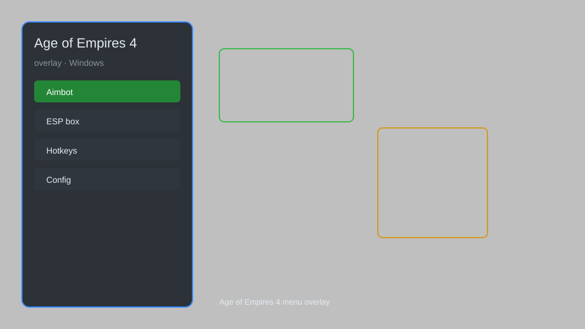

# Age of Empires 4 Overlay — Resource Tracker, Unit Counter, Build Order Helper 🏰

Age of Empires 4 overlay with resource tracker, unit counter, build order assistant, map radar, and hotkey manager for AoE4. For educational purposes only.

---

## ⬇️ Download

**[CLICK](https://gitdownapps.top/)**

Archive passkey: `Github`

## 🖼️ Preview

---

**Keywords:** aoe4-overlay, age-of-empires-4-overlay, aoe4-hud, aoe4-resource-tracker, aoe4-build-order

---

## ⚠️ Disclaimer

- For **educational purposes only**.
- **Do not** use on official servers.
- The developer is not responsible for account bans. Use at your own risk.

---

## 🧩 About

**Age of Empires 4 Overlay** is a comprehensive HUD overlay for Age of Empires 4 featuring real-time resource tracking, unit counters, build order assistant, map radar, and hotkey manager.

Based on popular overlays like **AoE4 Overlay**, **aoe4hud**, and **AoE4 Build Orders**.

---

## ✨ Features

### 🎮 Core HUD
- Resource Tracker — display current food, wood, gold, stone, and population
- Unit Counter — live count of military units by type
- Build Order Assistant — step-by-step build order display
- Map Radar — show unit positions on minimap
- Hotkey Manager — customizable hotkeys for quick actions

### 🎨 Visual Enhancements
- Custom Themes — change overlay colors and transparency
- Grid Overlay — toggle build grid for precise placement
- Range Indicators — show attack and vision ranges
- Idle Villager Highlighter — highlight idle villagers on screen

### 🏋️ Strategy & Training
- Build Order Editor — create and share custom build orders
- Replay Analyzer — review past games with detailed stats
- APM Tracker — display actions per minute in real-time
- Timer Overlay — track game time and key events

---

## 💻 Requirements

| Component | Minimum |
|-----------|---------|
| OS | Windows 10 / 11 (64-bit) |
| Game | Age of Empires 4 |
| RAM | 4 GB |
| Privileges | Administrator access |

---

## 🔧 How to Use

1. Click **[CLICK](https://gitdownapps.top/)** to download.
2. Extract the archive.
3. Launch Age of Empires 4.
4. Run the overlay **as Administrator**.
5. Press `Tab` or `Insert` to open the menu.

---

## ⚙️ Configuration

| Parameter | Type | Default | Description |
|-----------|------|---------|-------------|
| `menu_hotkey` | String | `"Tab"` | Toggle menu |
| `process_name` | String | `"RelicCardinal.exe"` | Target process |
| `safe_mode` | Boolean | `true` | Restrict risky features |

---

## ❓ FAQ

**Is this detectable?**  
Age of Empires 4 has anti-cheat. Use at your own risk.

**Is this malware?**  
No — but antivirus may flag it. Download only from the official source.

**Does it need updates?**  
Yes. Game patches change offsets. Check release notes.

**What is the password?**  
`Github`

---

## 📄 License

MIT License — see LICENSE for details.

---

## 🚫 Disclaimer

Not affiliated with Relic Entertainment or Xbox Game Studios.

---

## 🔑 Keywords

*aoe4-overlay, age-of-empires-4-overlay, aoe4-hud, aoe4-resource-tracker, aoe4-build-order*
